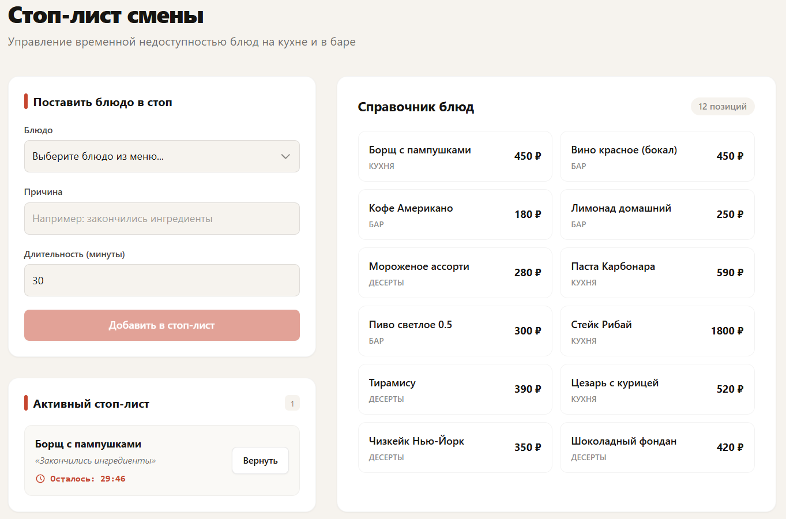

# Стоп-лист смены

Реализация функционала управления стоп-листом блюд для ресторана.



## Технологический стек

**Backend:**
- Node.js, Express, TypeScript
- Prisma ORM + SQLite 
- Zod 

**Frontend:**
- React 18+, TypeScript, Vite
- Tailwind CSS
- TanStack Query 
- Axios 

---

## Как запустить проект локально

### 1. Серверная часть
```bash
cd server

npm install

# Создание файла окружения (если его нет)
# Убедитесь, что в файле .env есть строка: DATABASE_URL="file:./dev.db"

# Инициализация базы данных и применение схемы
npx prisma db push
npx prisma generate

# Наполнение базы справочными данными (12 блюд)
npx tsx src/seed/dishes.ts

# Запуск сервера в режиме разработки
npm run dev 
```


### 2. Клиентская часть
```bash
cd client

# Установка зависимостей
npm install

# Запуск клиента в режиме разработки
npm run dev
```


### API Контракты

## 1. Справочник блюд
GET /api/dishes
Ответ: 200 OK — массив объектов Dish.

## 2. Активный стоп-лист
GET /api/stop-list?category=Кухня
Ответ: 200 OK — массив объектов StopListEntryView.

## 3. Постановка в стоп
POST /api/stop-list
Body: { "dishId": "uuid", "reason": "string (5-200 симв.)", "durationMinutes": "number (15-720)" }
Ответ: 201 Created — созданная запись.
Ошибки: 404 Not Found (блюдо не найдено), 409 Conflict (уже в стопе), 422 Unprocessable Entity (ошибка валидации Zod).

## 4. Возврат в продажу
PATCH /api/stop-list/:id/return
Описание: Досрочный возврат. Запись остается в истории, получает returnedAt.
Ответ: 200 OK — обновленная запись.
Ошибки: 404 Not Found, 409 Conflict (запись уже неактивна).

## 5. История стоп-листа
GET /api/stop-list/history?limit=20&offset=0
Описание: Завершенные записи (возвращенные или истекшие), сортировка от новых к старым. Значения по умолчанию: limit=20, offset=0.
Ответ: 200 OK — массив объектов StopListEntryView.
Ошибки: 422 Unprocessable Entity

---

## Архитектурные решения

### Разделение ответственности (Clean Architecture lite)
Маршруты (`routes`) занимаются только HTTP-слоем (парсинг, вызов сервиса, отправка ответа). Бизнес-логика инкапсулирована в `services` и не знает о существовании Express (`req`/`res`). Доступ к данным абстрагирован за интерфейсами `repositories`.

### Чистые функции и управление временем
В сервис `stopListService` текущее время передается как зависимость (`now: () => Date`). Это делает логику проверки истечения срока (`isActive`) чистой, предсказуемой и легко тестируемой, избегая скрытых вызовов `new Date()` внутри бизнес-правил.

### Валидация на границах
Используется `Zod` в middleware до попадания данных в сервис. Это гарантирует, что бизнес-логика работает только с типобезопасными и очищенными данными.

### SQLite вместо PostgreSQL
Выбран для обеспечения нулевой конфигурации при локальном запуске и проверке ревьюером (не требуется Docker или установка СУБД), при этом схема Prisma полностью реляционна и готова к миграции на PostgreSQL одной правкой `schema.prisma`.

### TanStack Query на клиенте
Позволяет избавиться от boilerplate-кода с `useEffect` и `useState` для загрузки данных, обеспечивает автоматическую инвалидацию кэша после мутаций и централизованную обработку состояний `isLoading`/`isError`.
